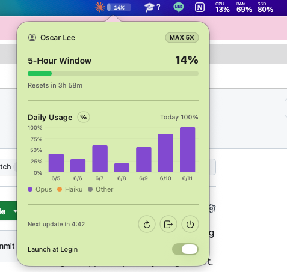

# ClaudeBar

[English](README.md) | **繁體中文**


一個輕巧的 macOS 選單列 app，一眼看到你的 **官方 Claude 5 小時用量**，並附上每日用量圖表。

<p align="center">
  
</p>

## 功能

- **官方用量** — 真實的 5 小時用量百分比與重置時間，和 Claude Code 的 `/usage` 同一份數字。
- **選單列一眼看** — Claude logo 旁有迷你進度條，5 小時百分比直接印在上面；點一下看細節。
- **每日圖表** — 最近一週的每日用量，依 model 家族（Opus / Sonnet / Haiku）堆疊；可切換百分比 / 金額。
- **設定面板** — 右上角齒輪打開面板內設定頁：帳號、切換帳號、登出、開機啟動、版本與更新。
- **自我更新** — 自動檢查 GitHub Releases 是否有新版，一鍵更新。
- **開機啟動** — 選用，一個開關。
- **隱私** — 只跟 Anthropic 通訊；你的 token 不會離開本機。

## 安裝

從 [Releases](../../releases) 下載 `.zip`，解壓後把 `ClaudeBar.app` 移到 `/Applications`。

此 app 為 ad-hoc 簽章（未經 notarize），首次啟動 Gatekeeper 會跳警告。可在 app 上按右鍵選 **打開**，或清除 quarantine：

```bash
xattr -dr com.apple.quarantine /Applications/ClaudeBar.app
```

或自行編譯：

```bash
swift build -c release && bash scripts/build-app.sh
```

## 使用

1. 點選單列圖示 → **Sign in with Claude**。
2. 在瀏覽器授權後，把回傳的 code（`code#state`）貼回 app。
3. 完成 — 選單列即顯示 5 小時用量。點開看進度條、重置倒數與每日圖表。

點右上角 **齒輪** 進設定：切換帳號、**開機啟動**、版本、**檢查更新**。

## 更新

當 GitHub Releases 發布新版時，app 會跳出 **更新橫幅** — 點 **Update** 即自動下載、替換、重啟。也可從 **設定 → Check for Updates** 手動觸發。
